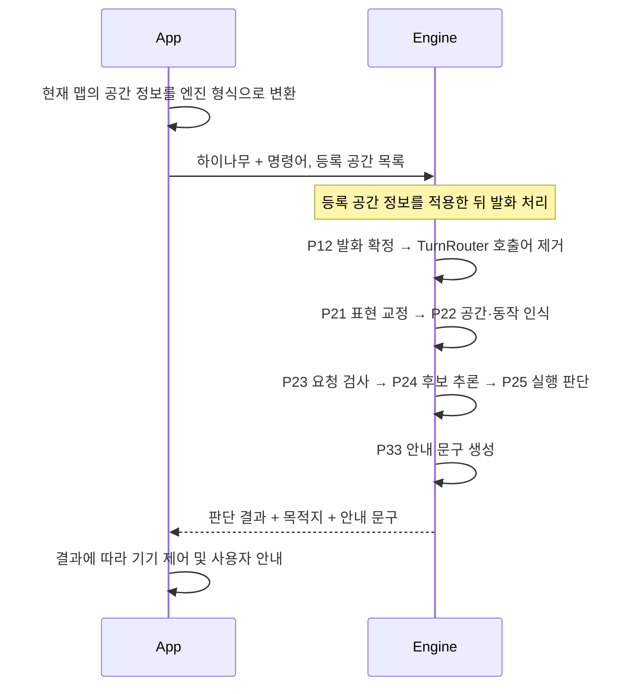

# App 음성 명령 입력 및 Engine 처리 흐름

## 1. App이 전달할 입력

App은 아래 두 정보를 **매 입력마다 함께 전달한다.**

| 입력 | 내용 |
|---|---|
| STT final text | `하이나무` + 명령어. 예: `하이나무 박종문방으로 이동해` |
| 등록 공간 정보 | 현재 선택된 맵의 등록 공간 목록과 각 공간의 이름·별칭 |


### 등록 공간 변환 규칙

- 원본 Map ID나 Parent Entity 값과 관계없이 **`parent_entity`는 항상 `<SPACE>`로 치환한다.**
- 일반 공간은 `<SPACE_SPACE1>`~`<SPACE_SPACE7>`에 매핑한다. `<SPACE_SPACE0>`은 스테이션이다.
- 공간 이름·별칭은 `aliases`에 넣는다. 공간 슬롯 ID와 공백 제거 후 같은 별칭은 중복되지 않아야 한다.
- 발화에 언급된 공간만 보내지 않고 **현재 맵의 등록 공간 목록**을 전달한다.
- App은 맵별 **엔진 슬롯 ID ↔ 실제 공간 ID 대응표**를 유지한다.

### Request Param

| 파라미터 | 타입 | 필수 | 설명 |
|---|---|---|---|
| `text` | string | Y | `하이나무` + 확정된 명령어 |
| `space_personalization` | object | Y | 현재 맵의 등록 공간 정보 |
| `space_personalization.parent_entity` | string | Y | Map ID와 관계없이 `<SPACE>` 고정 |
| `space_personalization.child_entity_list` | object[] | Y | 등록 공간 목록 |
| `child_entity_list[].child_entity` | string | Y | `<SPACE_SPACE0>`~`<SPACE_SPACE7>` 형식의 엔진 공간 ID |
| `child_entity_list[].aliases` | string[] | Y | 해당 공간의 이름·별칭 목록 |

`child_entity_list[]`는 `space_personalization` 내부 항목이다.

### Request 예시

Engine에 전달할 명령어와 등록 공간 정보를 묶어 표현한 형식이다.
Map ID가 `map-42`여도 `parent_entity`에는 `<SPACE>`를 넣는다.

```json
{
  "text": "하이나무 박종문방으로 이동해",
  "space_personalization": {
    "parent_entity": "<SPACE>",
    "child_entity_list": [
      {
        "child_entity": "<SPACE_SPACE1>",
        "aliases": ["박종문방"]
      },
      {
        "child_entity": "<SPACE_SPACE2>",
        "aliases": ["임혜민방"]
      }
    ]
  }
}
```

`text`와 `space_personalization`을 함께 준비한다. 공간 정보는 현재 맵 기준으로 전달한다.

## 2. Engine Sequence



Engine은 등록 공간과 이동 의도를 확인해 실행 여부를 판단한다.
미등록·복수 목적지 또는 지원하지 않는 요청은 실행하지 않고 안내 문구를 반환한다.
거절 조건이 확정되면 후보 추론을 생략할 수 있다.

각 발화는 독립적으로 처리한다. 재요청할 때도 호출어·명령어와 등록 공간 정보를 함께 전달한다.

## 3. App이 사용할 결과

| 결과 | App 처리 |
|---|---|
| 실행 판단 | `decision.type=execute`, `decision.function=공간이동`이면 목적지를 확인해 기기 제어 |
| 목적지 슬롯 ID | `decision.spaces[].space_id`를 입력 시 사용한 맵의 실제 공간 ID로 변환. SPACE0은 스테이션으로 처리 |
| 거절 판단 | `decision.type=fallback`이면 이동하지 않고 `fallback_reason`과 안내 문구 사용 |
| 안내 문구 | `reply.text`를 안내에 사용하고, `reply.action=speak`이며 문구가 있을 때만 TTS 수행 |

실행 여부와 목적지는 안내 문구를 분석하지 않고 Engine의 판단 결과를 사용한다.
Engine의 `execute`는 이동 요청에 대한 판단이며 실제 기기의 이동 완료를 의미하지 않는다.

### Response Param

Engine 결과가 생성되면 아래 필드를 반환한다. 값이 없을 때는 타입에 따라 null 또는 빈 배열이다.

| 파라미터 | 타입 | 설명 |
|---|---|---|
| `schema_version` | integer | 현재 `1` |
| `event` | string | `utterance_result` |
| `input_text` | string | Engine이 처리한 명령어. 정상 입력에서는 호출어가 제거됨 |
| `decision` | object | 실행 여부와 목적지 판단 |
| `decision.type` | string | `execute`, `fallback`, `defer`, `cancel`, `noop`, `silent_ignore`, `silent_observe` |
| `decision.function` | string 또는 null | 이동 실행 시 `공간이동` |
| `decision.ask_type` | string 또는 null | 현재 모바일 이동 모드에서는 null |
| `decision.fallback_reason` | string 또는 null | `unsupported_request`, `unknown_space`, `multiple_spaces` |
| `decision.noop_reason` | string 또는 null | `already_active`, `already_starting`. 해당 없으면 null |
| `decision.spaces` | object[] | 목적지 목록. 목적지가 없으면 빈 배열 |
| `decision.spaces[].space_id` | string 또는 null | 요청의 `child_entity`와 같은 엔진 공간 ID |
| `decision.spaces[].display_name` | string | 목적지 표시명 |
| `decision.unknown_spaces` | string[] | 미등록으로 판정한 공간명 목록 |
| `reply` | object | 사용자 안내 |
| `reply.text` | string 또는 null | 안내 문구 |
| `reply.action` | string | `speak`: TTS 수행, `none`: TTS 없음 |

### Response 예시 — 이동 실행

Engine의 JSON 출력 형식이다. `input_text`에는 호출어를 제거한 명령어가 들어간다.

```json
{
  "schema_version": 1,
  "event": "utterance_result",
  "input_text": "박종문방으로 이동해",
  "decision": {
    "type": "execute",
    "function": "공간이동",
    "ask_type": null,
    "fallback_reason": null,
    "noop_reason": null,
    "spaces": [
      {
        "space_id": "<SPACE_SPACE1>",
        "display_name": "박종문방"
      }
    ],
    "unknown_spaces": []
  },
  "reply": {
    "text": "박종문방으로 이동할게요.",
    "action": "speak"
  }
}
```

### Response 예시 — 미등록 공간

같은 등록 공간 정보로 `하이나무 회의실로 이동해`를 전달한 경우다.

```json
{
  "schema_version": 1,
  "event": "utterance_result",
  "input_text": "회의실로 이동해",
  "decision": {
    "type": "fallback",
    "function": null,
    "ask_type": null,
    "fallback_reason": "unknown_space",
    "noop_reason": null,
    "spaces": [],
    "unknown_spaces": ["회의실"]
  },
  "reply": {
    "text": "음성을 이해하지 못했어요. 다시 시도해 주세요.",
    "action": "speak"
  }
}
```

`fallback_reason`은 미지원 요청·목적지 누락이면 `unsupported_request`,
미등록 공간이면 `unknown_space`, 복수 공간이면 `multiple_spaces`다.

## 4. 결과 예시

`박종문방`, `임혜민방`이 등록된 경우다. 아래 명령은 모두 앞에 `하이나무`를 붙여 전달한다.

| 명령어 | 판단 | 안내 문구 |
|---|---|---|
| 박종문방으로 이동해 | 박종문방 이동 | 박종문방으로 이동할게요. |
| 스테이션으로 돌아가 | 스테이션 이동 | 스테이션으로 이동할게요. |
| 이동해 | 목적지 누락으로 거절 | 음성을 이해하지 못했어요. 다시 시도해 주세요. |
| 회의실로 이동해 | 미등록 공간으로 거절 | 음성을 이해하지 못했어요. 다시 시도해 주세요. |
| 박종문방이랑 임혜민방으로 가줘 | 복수 공간으로 거절 | 하나의 공간만 말씀해 주세요. |
