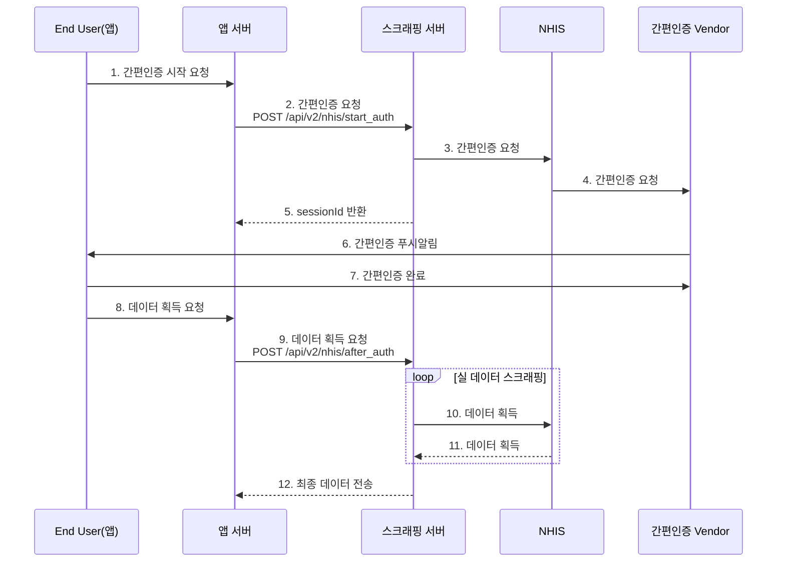

# nhis-scrapper

<strong>문서 버전</strong>: v2 · <strong>최종 수정일</strong>: 2026-07-08

**수정 이력**

| 버전 | 일자 | 주요 변경 |
| --- | --- | --- |
| v1 | — | 최초 작성 |
| v2 | 2026-07-08 | - 문서 버전·수정 이력 표기 도입 |

```mermaid
sequenceDiagram
    participant a as End User(앱)
    participant b as 앱 서버
    participant c as 스크래핑 서버
    participant d as NHIS
    participant e as 간편인증 Vendor

    a->>b: 1. 간편인증 시작 요청
    b->>c: 2. 간편인증 요청<br/>POST /api/v2/nhis/start_auth
    c->>d: 3. 간편인증 요청
    d->>e: 4. 간편인증 요청
    c-->>b: 5. sessionId 반환
    e->>a: 6. 간편인증 푸시알림
    a->>e: 7. 간편인증 완료
    a->>b: 8. 데이터 획득 요청
    b->>c: 9. 데이터 획득 요청<br/>POST /api/v2/nhis/after_auth

    loop 실 데이터 스크래핑
        c->>d: 10. 데이터 획득
        d-->>c: 11. 데이터 획득
    end

    c-->>b: 12. 최종 데이터 전송
```
