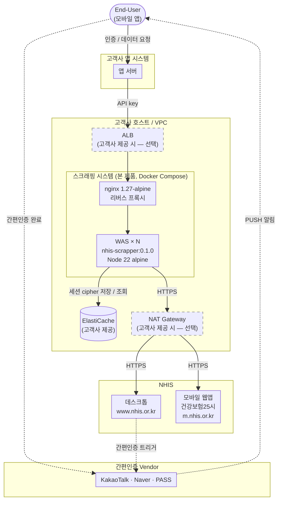
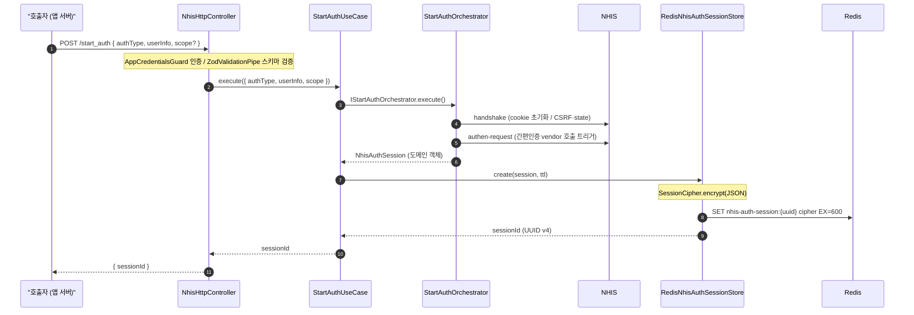
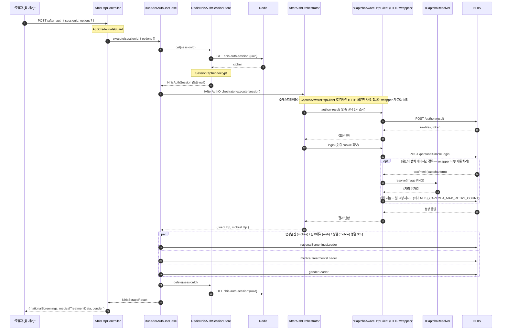
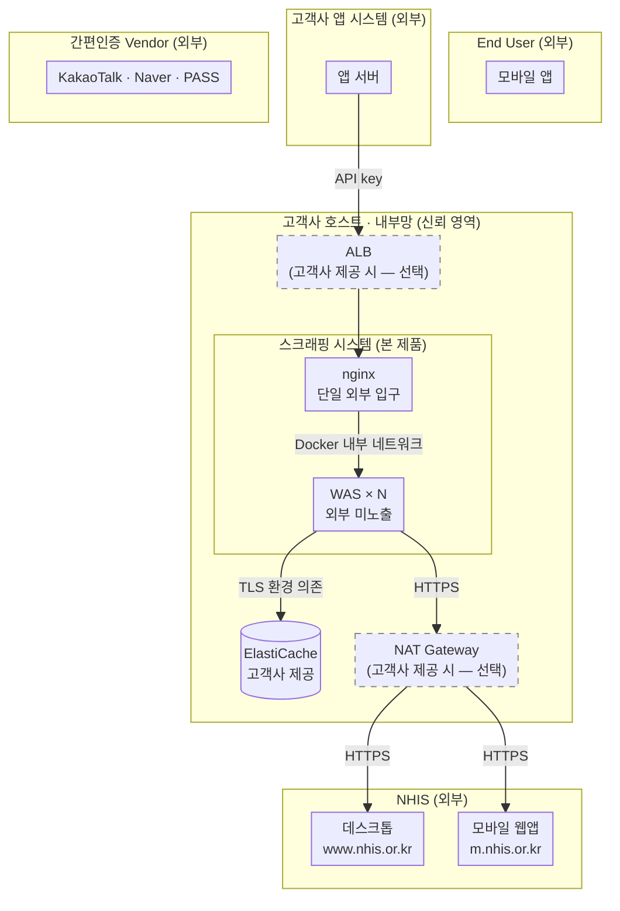

# nhis-scrapper 아키텍처 문서

<div align="right"><strong>문서 버전</strong>: v2 · <strong>최종 수정일</strong>: 2026-07-08</div>

**수정 이력**

| 버전 | 일자 | 주요 변경 |
| --- | --- | --- |
| v1 | — | 최초 작성 |
| v2 | 2026-07-08 | - start_auth·after_auth 요청 body 에 scope/options 반영<br/>- 성별정보 병렬 수집 반영<br/>- 진료내역 목록 동시성 환경변수 2종 추가 (부록 B)<br/>- 로그 마스킹 라우트별 `@UnmaskLogPaths` 예외 반영 (§5.4) |

<div style="page-break-after: always;"></div>

| 항목                | 내용                                                                                                              |
| ------------------- | ----------------------------------------------------------------------------------------------------------------- |
| 제품명              | nhis-scrapper                                                                                                     |
| 버전                | 0.1.0                                                                                                             |
| 공급자              | 렉스소프트                                                                                                        |
| 대상 외부 시스템    | 국민건강보험공단(NHIS) 데스크톱 웹페이지 (`www.nhis.or.kr`), 모바일 웹앱 페이지 「건강보험25시」 (`m.nhis.or.kr`) |
| 함께 보아야 할 문서 | `구조도.png`, `SEQUENCE-DIAGRAM.md`, `../api문서/API.docx`                                                        |

---

## 1. 개요

nhis-scrapper 는 국민건강보험공단(이하 NHIS) 의 데스크톱 웹페이지(`www.nhis.or.kr`)
및 모바일 웹앱 페이지 「건강보험25시」(`m.nhis.or.kr`) 로부터
사용자 본인 동의 하에 건강검진·진료내역 등 개인 의료 데이터를 수집하여
호출자(고객사 앱 서버) 에게 표준화된 JSON 으로 제공하는 **스크래핑 게이트웨이** 입니다.

호출자(앱 서버) 가 직접 NHIS 웹페이지를 다루지 않도록 다음 책임을 캡슐화합니다:

- NHIS 의 간편인증 트랜잭션(handshake → 인증 요청 → 인증 결과 조회 → 로그인) 다단계 흐름 조율
- 인증 완료 후 다수의 HTML/JSON 엔드포인트에서 의료 데이터 추출
- 세션 cookie 유지, 캡차 자동 인식·재시도, 동시성·재시도 정책 적용
- 개인정보가 포함된 세션 상태의 암호화 보관

호출자에게 노출되는 HTTP 엔드포인트는 다음과 같습니다 (스크래핑 API 명세는 `../api문서/API.docx` 참조):

| 메서드 / 경로                  | 인증         | 책임                                                                                                                            |
| ------------------------------ | ------------ | ------------------------------------------------------------------------------------------------------------------------------- |
| `POST /api/v2/nhis/start_auth` | API key 헤더 | 사용자 정보를 받아 간편인증을 개시. 세션 식별자(`sessionId`) 를 반환                                                            |
| `POST /api/v2/nhis/after_auth` | API key 헤더 | 사용자가 외부 vendor 에서 본인확인을 완료한 후 `sessionId` 로 호출.<br/>인증 결과를 NHIS 에서 조회한 뒤 의료 데이터를 스크래핑·반환 |
| `GET /health`                  | 없음         | 헬스체크 (readiness)                                                                                                            |

---

## 2. 시스템 구성

### 2.1 전체 구성도

전체 흐름은 `구조도.png` 와 `SEQUENCE-DIAGRAM.md` 를 참조하십시오. 본 절은 정적 구성(컴포넌트 배치) 만 도식화합니다.



> ALB · NAT Gateway 는 고객사 제공·선택 사항(점선 표기)입니다. 미사용 시 앱 서버가 nginx 로 직접 진입하고, WAS 가 NHIS 로 직접 발신합니다.
> 본 제품은 모든 경로에서 API key 헤더 인증을 강제하며, TLS 종단 위치(ALB / nginx / 미적용) 와 WAS ↔ ElastiCache 의 TLS 적용 여부는 고객사 환경 구성에 따라 결정됩니다.
> 본 제품의 스코프는 `nginx + WAS` 박스이며, ALB·NAT Gateway·ElastiCache·앱 서버 는 고객사 제공입니다.

### 2.2 컴포넌트별 역할

| 컴포넌트                                           | 책임                                                                                                    | 비고                                                                                                         |
| -------------------------------------------------- | ------------------------------------------------------------------------------------------------------- | ------------------------------------------------------------------------------------------------------------ |
| End-User (모바일 앱)                               | 사용자 본인 식별 정보 입력, 간편인증 PUSH 승인                                                          | 본 제품 범위 외                                                                                              |
| 앱 서버 (고객사)                                   | End-User 와 스크래핑 시스템 사이의 중계, 본 제품의 API 호출                                             | 본 제품 범위 외                                                                                              |
| ALB                                                | 외부 진입 트래픽의 nginx 앞단 게이트웨이. 고객사 정책에 따라 TLS 종단·헬스체크·로깅 등을 수행할 수 있음 | **선택** — 고객사 제공 시.<br/>미사용 시 앱 서버가 nginx 의 `${NGINX_PORT}` 로 직접 진입. <br/>**권장**: internal ALB |
| NAT Gateway                                        | WAS → NHIS 발신 트래픽의 외부 출구. 단일 EIP 또는 AZ별 다수 EIP 운영 가능                               | **선택** — 고객사 제공 시.<br/>권장 토폴로지에서 WAS 발신 경로                                                   |
| **nginx**                                          | 본 제품의 단일 외부 입구. 리버스 프록시·정적 라우팅으로 WAS 다중 인스턴스에 부하 분산                   | `nginx:1.27-alpine`<br/>세부 설정은 고객사 환경에 맞추어 커스텀 필요                                                                                          |
| **WAS**                                            | NestJS 애플리케이션. HTTP 엔드포인트 처리, NHIS 통신, 데이터 파싱, 세션 관리                            | `Node 22 alpine`, 다중 인스턴스                                                         |
| **ElastiCache**                                    | 세션 상태 보관 (AES-256-GCM 암호화 후 저장)                                                             | 고객사 제공.<br/>WAS ↔ ElastiCache 의 TLS 적용 여부는 고객사 환경 구성에 따름             |
| NHIS 데스크톱 (`www.nhis.or.kr`)                   | 본인 인증·의료데이터 출처                                                                               | 외부망, HTTPS                                                                                                |
| NHIS 모바일 웹앱 「건강보험25시」 (`m.nhis.or.kr`) | 본인 인증·의료데이터 출처                                                                               | 외부망, HTTPS                                                                                                |
| 간편인증 Vendor                                    | 사용자 측 본인확인 (KakaoTalk / Naver / PASS 등)                                                        | 본 제품과 직접 통신하지 않음                                                                                 |

### 2.3 외부 의존성

| 의존성                                              | 종류                                  | 통신 방식                                                    |
| --------------------------------------------------- | ------------------------------------- | ------------------------------------------------------------ |
| NHIS 데스크톱 (`www.nhis.or.kr`)                    | 외부 HTTP 엔드포인트                  | HTTPS, cookie 기반 세션                                      |
| NHIS 모바일 웹앱 (`m.nhis.or.kr`, 「건강보험25시」) | 외부 HTTP 엔드포인트                  | HTTPS, cookie 기반 세션                                      |
| ElastiCache (고객사 제공)                           | 내부 Redis 호환 캐시                  | 인증·TLS 적용 여부는 고객사 환경 구성에 따름                 |
| ALB (고객사 제공 — 선택)                            | nginx 앞단 외부망 진입                | 고객사 ALB 정책에 따라 TLS 종단·헬스체크 등이 수행될 수 있음 |
| (선택) `NET_PROXY_URL`                              | 외부망 출구 프록시                    | `http(s)://` 프록시 URL 설정 시 HTTP/HTTPS 요청 우회         |
| captcha-inference (npm)                             | NHIS 캡차 자동 인식용 ESM 모듈 (자체) | 프로세스 내 dynamic import                                   |

### 2.4 배포 토폴로지

본 제품은 Docker Compose 단일 호스트 배치를 기본으로 합니다:

- 외부 인입: `nginx` 컨테이너의 `${NGINX_PORT}` (기본 80) 만 노출.
- WAS 컨테이너는 외부 미노출. `nginx` 를 거쳐서만 접근 가능.
- WAS 인스턴스 수 N = 호스트 vCPU 수 (`nproc`) 권장.
- Redis 컨테이너는 번들에 미포함. **고객사 ElastiCache** 의 엔드포인트를 환경변수로 주입.
- **ALB 가 고객사 환경에 존재하는 경우** nginx 앞단에 배치 가능.
  없으면 앱 서버가 nginx 의 `${NGINX_PORT}` 로 직접 진입.
  어느 경우든 전송 보안(HTTP / HTTPS) 적용 여부와 TLS 종단 위치는 고객사 환경 구성에 따름 —
  본 제품 측은 API key 헤더 인증만 강제하고 TLS 정책은 강제하지 않음.

#### 권장 토폴로지

본 제품은 고객사 내부 server-to-server API 로 호출되는 형태를 전제로 합니다. 권장 토폴로지는 다음과 같습니다 (실제 배치는 고객사 환경에 따름):

- **인입**: 고객사 앱 서버 → internal ALB → nginx → WAS. 전 구간 고객사 내부망. 인터넷 직접 인입 없음.
- **NHIS 발신**: WAS → NAT Gateway → NHIS. WAS 는 private subnet 에 위치하고 외부 출구는 NAT Gateway 경로.
- ALB / NAT Gateway 모두 고객사 제공·선택 사항입니다.

### 2.5 무상태(stateless) 및 수평 확장

WAS 인스턴스는 무상태(stateless) 로 설계되어 있습니다.
요청 처리에 필요한 모든 교차-요청 상태(NHIS cookie, 인증 phase, 본인확인 메타데이터 등) 는 단일 트랜잭션 동안에만 메모리에 존재하고,
트랜잭션을 가로지르는 상태는 ElastiCache 에 AES-256-GCM 으로 암호화하여 적재됩니다 (기본 TTL 600초)
(§ 4.3, § 5.3 참조).

따라서 본 제품의 처리량(throughput) 은 WAS 인스턴스 수에 거의 선형 비례합니다.
단일 WAS 인스턴스 내부의 NHIS 호출 동시성은
`NHIS_MEDICAL_TREATMENT_DETAIL_CONCURRENCY` 등 환경변수로 별도 제어합니다
(§ 부록 B 참조).

---

## 3. 모듈 구조

본 제품은 NestJS 11.x 기반 TypeScript 애플리케이션으로, 헥사고날 아키텍처 패턴을 따릅니다.

### 3.1 부트스트랩 흐름

`src/main.ts`

1. `NestFactory.create(AppModule)` 로 컨텍스트 생성
2. 전역 등록
   - 글로벌 예외 필터 `ExceptionHandleFilter` — `AbstractError` 계층의 예외를 표준 응답으로 변환
   - 글로벌 인터셉터 `NhisResponseTransformInterceptor` — 응답 본문 표준 형태 래핑
   - 글로벌 파이프 `ZodValidationPipe` — DTO 검증
3. `ConfigService` 에서 `PORT` 조회 후 리스닝

`src/app.module.ts`

- 미들웨어 체인:
  1. `RequestContextMiddleware` — `requestId` 발급 + `AsyncLocalStorage` 컨텍스트 시드
  2. `HttpRequestLoggerMiddleware` — HTTP 요청·응답 로깅 (마스킹 적용)

### 3.2 최상위 구성

**NestJS 모듈 (5개):**

| 모듈           | 위치          | 책임                                                                                               |
| -------------- | ------------- | -------------------------------------------------------------------------------------------------- |
| `ConfigModule` | `src/config/` | 환경변수 Zod 스키마 검증, 전역(`isGlobal: true`) 등록. 부적합 시 부팅 실패(fail-fast)              |
| `RedisModule`  | `src/redis/`  | `ioredis` 클라이언트 싱글턴 제공. `REDIS_CLUSTER_MODE=true` 시 `Redis.Cluster` 사용                |
| `AuthModule`   | `src/auth/`   | `AppCredentialsGuard` — API 호출자 헤더 인증                                                       |
| `HealthModule` | `src/health/` | `GET /health` 라우트 — Redis PING 으로 의존 인프라 readiness 확인                                  |
| `NhisModule`   | `src/nhis/`   | 핵심 기능 구현. HTTP 컨트롤러·유스케이스·오케스트레이터·HTTP 세션·파서·데이터로더·세션 스토어 등록 |

**공통 횡단 코드 (`src/common/`)**

`src/common/` 은 NestJS @Module 이 아닌 공유 네임스페이스로, 위 4개 모듈이 공통으로 의존하는 횡단 관심사를 모아 둡니다. 주요 항목은 다음과 같습니다:

- **보안** — 세션 데이터 암복호화 (§5.3), 로그 마스킹 (§5.4)
- **요청 처리 파이프라인** — 글로벌 필터·인터셉터·파이프·미들웨어. AppModule 부트스트랩 단계에서 자동 등록되어 모든 라우트에 일관되게 적용
- **에러 모델** — 도메인 예외의 공통 베이스 클래스(`AbstractError`) 와 OpenAPI 스펙 연동
- **공유 유틸** — `AsyncLocalStorage` 기반 요청 컨텍스트, 동시성 제한, 기타 순수 함수 유틸

### 3.3 계층 분리

핵심 모듈 `src/nhis/` 는 3개 계층으로 분리됩니다:

```
src/nhis/
├── domain/                    프레임워크·외부 의존성 없이 본 서비스의 개념을 표현하는 순수 도메인 계층
│   ├── entities/                인증 세션, 검진·진료내역 항목 등 핵심 도메인 객체의 데이터 구조
│   ├── enums/                   인증 수단·세션 유형 등 도메인에서 사용하는 고정 분류값
│   ├── errors/                  AbstractError 를 상속하는 도메인 예외 — 호출자에게 노출되는 표준 오류 표면
│   └── constants/               엔드포인트 키·헤더 키·세션 유형 집합 등 도메인 로직이 참조하는 상수
│
├── application/               유스케이스 구현과 인프라 의존성 추상화(포트)를 담당하는 계층
│   ├── usecases/                HTTP 요청 1건당 실행되는 비즈니스 시나리오 (StartAuth / RunAfterAuth)
│   ├── ports/                   인프라 의존성을 역전시키기 위한 인터페이스 모음
│   └── utils/                   유스케이스 간 공유되는 순수 함수 유틸
│
├── infrastructure/            외부 시스템·프레임워크와 도메인을 잇는 어댑터 계층
│   ├── controllers/             NestJS Controller — 외부 HTTP 요청을 받아 유스케이스로 위임
│   ├── auth/                    NHIS 간편인증·로그인 트랜잭션의 오케스트레이터와 단위 step 구현
│   ├── http/                    NHIS 호출용 HTTP 세션 구현 (cookie jar / agent / 프록시 / 캡차 wrapper)
│   ├── captcha/                 캡차 해석기 어댑터 — 자체 OCR 모듈을 ICaptchaResolver 인터페이스에 결합
│   ├── parsers/                 NHIS HTML/JSON 응답을 도메인 엔티티로 변환하는 파서 구현
│   ├── data-loader/             인증 후 NHIS 데이터 페이지를 호출해 도메인 데이터를 수집하는 로더 구현
│   └── persist/                 세션 영속화 어댑터 — Redis 입출력 및 암복호화 결합
│
└── contracts/                컨트롤러 요청·응답 DTO (zod 스키마 기반)
```

`common/` 디렉터리는 도메인 비종속 횡단 관심사를 제공합니다:

```
src/common/
├── concurrency/                p-limit 기반 동시성 제한
├── context/                    AsyncLocalStorage 기반 요청 컨텍스트
├── crypto/                     SessionCipher (AES-256-GCM)
├── decorators/                 ApiResponse 등 컨트롤러 데코레이터
├── dtos/                       표준 응답·에러 응답 DTO
├── errors/                     AbstractError 베이스 + 표준 HTTP 에러 클래스
├── filters/                    글로벌 예외 필터 (ExceptionHandleFilter)
├── interceptors/               응답 변환 인터셉터
├── logger/                     winston + nest-winston, 로그 마스킹
├── middleware/                 RequestContext / HttpRequestLogger
├── pipes/                      Zod 검증 파이프
└── utils/
```

### 3.4 Port / Adapter

`application/ports/` 의 인터페이스를 `infrastructure/` 의 클래스가 구현합니다. 의존성 역전을 통해 도메인·유스케이스가 인프라 변경에 흔들리지 않도록 하고, 테스트에서는 fake/in-memory 어댑터로 교체합니다.

#### 인증 / 데이터 스크래핑 오케스트레이션

| Port                     | Adapter                 | 책임                                                                                                                                               |
| ------------------------ | ----------------------- | -------------------------------------------------------------------------------------------------------------------------------------------------- |
| `IStartAuthOrchestrator` | `StartAuthOrchestrator` | 간편인증 개시 트랜잭션 (handshake → authen-request → 세션 생성)                                                                                    |
| `IAfterAuthOrchestrator` | `AfterAuthOrchestrator` | NHIS 인증 결과 조회 → NHIS 로그인 후 web/mobile HTTP 세션을 반환. 데이터 로더 호출은 유스케이스가 담당. 캡차 재시도는 HTTP wrapper 가 처리 (§ 4.4) |

#### NHIS HTTP 클라이언트 — 대상별 분리 + 타입 brand

NHIS 는 데스크톱과 모바일 두 채널을 운영하며, 각각의 도메인이 독립된 cookie jar 와 인증 컨텍스트를 가집니다. 같은 세션 내에서도 호출 대상에 따라 별도 HTTP 클라이언트를 사용해야 cookie 가 혼입되지 않습니다. 이를 위해 본 제품은 대상별로 분리된 두 개의 포트를 둡니다:

| Port                    | 대상                                            |
| ----------------------- | ----------------------------------------------- |
| `INhisWebHttpClient`    | NHIS 데스크톱 (`www.nhis.or.kr`)                |
| `INhisMobileHttpClient` | NHIS 모바일 웹앱 (`m.nhis.or.kr`, 건강보험25시) |

수집할 데이터의 특성에 따라 web / mobile 채널을 나누어 호출합니다:

- **건강검진 데이터** — 모바일 채널 호출. 응답의 데이터 구조가 분석에 용이.
- **처방조제 · 외래 진료내역 데이터** — 웹 채널 호출. 모바일 채널의 호출 수 제한을 피하기 위함.

#### 캡차 / 세션 영속화 / 파서

| Port                             | Adapter                     | 책임                                                                                     |
| -------------------------------- | --------------------------- | ---------------------------------------------------------------------------------------- |
| `ICaptchaResolver`               | `CaptchaInferenceResolver`  | 캡차 PNG → 6자리 문자열. 자체 `captcha-inference` ESM 모듈을 dynamic import 로 지연 로딩 |
| `INhisAuthSessionStore`          | `RedisNhisAuthSessionStore` | 세션 영속화 (Redis + AES-256-GCM 암호화)                                                 |
| `IHtmlParser<TContext, TOutput>` | 다수의 `*.parser.ts` 구현   | NHIS HTML 응답 → 도메인 객체                                                             |

#### 데이터 로더 (NHIS 응답 → 도메인 데이터 추출)

| Port                        | Adapter                    | 출력                                   |
| --------------------------- | -------------------------- | -------------------------------------- |
| `IGenderLoader`             | `GenderLoader`             | `{ gender }`                           |
| `INationalScreeningsLoader` | `NationalScreeningsLoader` | 건강검진 이력 (목록 + 상세 병렬 fetch) |
| `IMedicalTreatmentsLoader`  | `MedicalTreatmentsLoader`  | 진료내역 (목록 + 상세 병렬 fetch)      |

세 로더는 `AfterAuthOrchestrator` 에서 실행되며, 각자의 호출 동시성·간격은 환경변수(`NHIS_*_CONCURRENCY` / `NHIS_*_DELAY_MS`) 로 독립적으로 제어합니다.

---

## 4. 데이터 흐름

### 4.1 간편인증 흐름 (`/api/v2/nhis/start_auth`)

End-User 와 간편인증 Vendor 사이의 외부 흐름까지 포함한 전체 시퀀스는 `SEQUENCE-DIAGRAM.md` 를 참조하십시오. 본 절은 본 제품 내부의 컴포넌트 간 호출 흐름만 다룹니다.



⑤ 단계(authen-request) 이후 NHIS 가 사용자 디바이스로 간편인증 vendor PUSH 알림을 발송하며, 사용자는 vendor 앱에서 본인확인을 완료합니다. 본 제품은 이 외부 흐름에 관여하지 않습니다.

### 4.2 데이터 스크래핑 흐름 (`/api/v2/nhis/after_auth`)



병렬 호출의 호스트당 동시성과 호출 간 지연은 환경변수로 제어합니다 (§ 부록 B 참조).

사용자 측 본인확인이 아직 완료되지 않은 상태에서 호출되면
NHIS 가 해당 사실을 응답에 담아 반환하고 본 제품은 `NhisAuthResultFailedError` 로 즉시 실패 처리합니다.
따라서 호출자(앱 서버) 는 사용자가 vendor 앱에서 본인확인을 마친 이후 `after_auth` 를 호출해야 합니다.

### 4.3 세션 수명 및 관리

| 항목             | 값 / 정책                                              |
| ---------------- | ------------------------------------------------------ |
| 식별자 형식      | UUID v4, Redis key 패턴 `nhis-auth-session:{uuid}`     |
| 저장 매체        | ElastiCache                                            |
| 저장 형태        | 암호문. 평문 JSON → AES-256-GCM 암호화 → base64 인코딩 |
| 기본 TTL         | `NHIS_SESSION_TTL_SECONDS` (기본 600 초)               |
| 생성 시점        | `start_auth` 응답 시점                                 |
| 삭제 시점        | `after_auth` 정상 완료 직후 / 또는 TTL 만료  |
| 복호화 실패 처리 | null 반환 (만료·미존재와 동일하게 외부에 노출)         |

세션 객체에는 NHIS cookie, 본인확인 메타데이터, 인증 phase 등이 포함되며 외부 노출되지 않습니다.

### 4.4 캡차 처리

NHIS 일부 데이터 페이지는 캡차를 요구합니다.
캡차 처리 로직은 HTTP 클라이언트 wrapper 안에 위치합니다.
(`CaptchaAwareHttpClient`, `src/nhis/infrastructure/http/captcha-aware-http-client.ts`)
오케스트레이터는 NHIS 페이지 호출만 발행하고, wrapper 가 응답을 가로채어 다음 절차를 자동 수행합니다:

1. NHIS 응답 본문이 `text/html` 이고 캡차 폼이 감지되면
2. 폼 내 캡차 이미지(PNG) 를 추출하여 `ICaptchaResolver.resolve()` 호출
3. `CaptchaInferenceResolver` 가 사내 자체 OCR 모듈(`captcha-inference`) 로 6자리 문자열 인식
4. 인식값과 함께 폼을 재제출 → 정상 응답을 얻을 때까지 재시도
5. `NHIS_CAPTCHA_MAX_RETRY_COUNT` (기본 5회) 초과 시 실패 처리

`captcha-inference` 는 ESM 패키지이며 dynamic `import()` 로 지연 로딩됩니다.

#### 캡차 인식 모델 정확도

`captcha-inference` 가 탑재한 6자리 숫자 인식 모델은 별도 프로젝트에서 학습·검증되었습니다.

| 지표                               | 값             |
| ---------------------------------- | -------------- |
| Test exact-match (6자리 전부 일치) | 92.27%         |
| Wilson 95% 신뢰구간 (exact)        | [91.8%, 94.6%] |

본 제품은 단일 캡차 페이지에서 최대 `NHIS_CAPTCHA_MAX_RETRY_COUNT` (기본 5) 회 재시도하므로, 한 세션 내 캡차 페이지 한 건에서 5회 연속 인식 실패가 발생할 확률은 위 정확도 기준 약 (1 - 0.9227)⁵ ≈ 0.00028% 입니다.

---

## 5. 보안 구간

본 절은 시스템을 위협 모델 관점에서 신뢰 영역별로 구분하고, 각 경계에서의 통제 수단을 명시합니다.

### 5.1 네트워크 경계 및 신뢰 영역

아래 다이어그램은 본 제품 외부의 신뢰 영역(End User · 고객사 앱 시스템 · NHIS · 간편인증 Vendor) 을 각각 별도 박스로 표시하고, 본 제품이 배포되는 호스트(신뢰 영역) 와 그 안의 컴포넌트 배치를 보여줍니다.



| 경계                           | 통제                                                                                                                                                    |
| ------------------------------ | ------------------------------------------------------------------------------------------------------------------------------------------------------- |
| 외부 → ALB (있는 경우)         | 고객사 ALB 정책에 따라 TLS 종단·헬스체크 등이 수행될 수 있음.<br/>인증서·시크릿은 ALB 측 관리. 권장 토폴로지에서는 internal ALB — 고객사 내부망 인입만 허용 |
| 외부 → nginx (ALB 미사용 시)   | TCP 단일 포트만 노출. nginx 의 보안 헤더·요청 크기 제한·연결 수 제한.<br/>전송 보안(HTTP / HTTPS) 적용 여부는 고객사 환경 구성에 따름                       |
| nginx → WAS                    | 내부 Docker network 만 통과. WAS 컨테이너는 외부 미노출                                                                                                 |
| WAS → ElastiCache              | 내부망. 인증 및 TLS 적용 여부는 모두 고객사 환경 구성에 따름                                                                                            |
| WAS → NHIS (데스크톱 / 모바일) | HTTPS (기본). 권장 토폴로지에서는 NAT Gateway 경유 — NAT EIP 가 발신 IP.<br/>선택적으로 `NET_PROXY_URL` 로 외부망 출구 프록시 경유 가능                     |
| 호출자 → WAS API               | §5.2 참조                                                                                                                                               |

### 5.2 외부 API 접근통제 (`AppCredentialsGuard`)

`/api/v2/nhis/*` 양쪽 엔드포인트에 `@UseGuards(AppCredentialsGuard)` 적용. 호출자는 다음 2개 헤더를 모두 제시해야 합니다:

| 헤더                            | 값                                        |
| ------------------------------- | ----------------------------------------- |
| `x-nhis-scrapper-access-key`    | 환경변수 `AUTH_APP_KEY` 와 일치해야 함    |
| `x-nhis-scrapper-access-secret` | 환경변수 `AUTH_APP_SECRET` 과 일치해야 함 |

검증 방식:

- 양 값을 SHA-256 해시한 뒤 `crypto.timingSafeEqual` 로 상수시간 비교 → 타이밍 사이드채널 공격 방지
- 불일치 시 `NhisInvalidAppCredentialsError` (HTTP 401)

IP allow-list 는 사용하지 않으며, 헤더 기반 인증 + nginx 단의 네트워크 차폐로 외부 접근을 제한합니다.
IP 제한 필요시 고객사측 인프라 혹은 호스트 추가 설정이 필요합니다.

예외: `GET /health` 는 LB / ALB 가 직접 호출하는 헬스체크 경로이므로 `AppCredentialsGuard` 미적용입니다.
정상 상태에서는 200 `{ status: "ok", redis: "ok" }` 를 반환하며,
Redis 연결이 실패하거나 PING 타임아웃이 발생하면 503 으로 응답하여 LB 가 해당 인스턴스를 트래픽 풀에서 제외할 수 있도록 합니다.

### 5.3 세션 데이터 암호화 (`SessionCipher`, AES-256-GCM)

`src/common/crypto/session-cipher.service.ts`

| 항목       | 값                                                                                                                   |
| ---------- | -------------------------------------------------------------------------------------------------------------------- |
| 알고리즘   | AES-256-GCM                                                                                                          |
| 키 파생    | `NHIS_SESSION_ENCRYPTION_KEY` (passphrase, 32자 이상 필수) → `scryptSync(key, "nhis-scrapper-session-v1", 32 bytes)` |
| Salt       | 고정값 `"nhis-scrapper-session-v1"` (결정적 파생 — 같은 passphrase 는 항상 같은 키, 다중 인스턴스 일관성)            |
| Nonce (IV) | 매 암호화마다 무작위 12 byte 생성 -> nonce 재사용 없음                                                               |
| Auth Tag   | 16 byte, 위·변조 탐지                                                                                                |
| 토큰 포맷  | `base64( iv ‖ authTag ‖ ciphertext )`                                                                                |
| 저장 매체  | Redis. 평문은 메모리 외 어디에도 존재하지 않음                                                                       |

### 5.4 로그 마스킹 (allowlist 방식)

`src/common/logger/log-safe-keys.constants.ts`, `src/common/logger/log-redaction.constants.ts`, `src/common/logger/winston.logger.ts`, `src/common/logger/unmask-log-paths.decorator.ts`, `src/common/logger/request-log-unmask.registry.ts`

본 제품의 로그 마스킹은 "기본 마스킹 + 허용 키만 노출" 방침을 따릅니다 (블랙리스트 방식이 아닌 화이트리스트 방식):

| 카테고리                   | 동작                                                                                                                                                                                                                                                                                                                                                                                       |
| -------------------------- | ------------------------------------------------------------------------------------------------------------------------------------------------------------------------------------------------------------------------------------------------------------------------------------------------------------------------------------------------------------------------------------------ |
| `LOG_SAFE_KEYS`            | 비식별 필드 화이트리스트. 카테고리별로 분류 — winston/nest 내부(`level`, `message`, `timestamp`, `context` 등), 횡단 컨텍스트(`requestId`, `sessionId`), 비즈니스 식별 코드(`event`, `step`, `phase`, `authType`, `direction`, `target` 등), 카운터·지표(`durationMs`, `count`, `attempt` 등), 에러 진단(`stack`, `errorCode`, `errorName`).<br/>전체 목록은 `log-safe-keys.constants.ts` 참조 |
| 그 외 모든 leaf 값         | `maskValue` 가 적용 — 첫·끝 글자만 남기고 중간을 글자수만큼 `*` 로 치환 (예: `홍길동` → `홍*동`, `010-1234-5678` → `0***********8`)                                                                                                                                                                                                                                                        |
| `INBOUND_LOG_ALLOWED_KEYS` | 인입 HTTP 요청 파라미터 중 로깅을 허용하는 키 별도 화이트리스트 (`authType`, `telcoTycd`, `sessionId`)                                                                                                                                                                                                                                                                                     |
| `@UnmaskLogPaths` (라우트별 예외) | 특정 라우트의 **비민감 경로만** 마스킹 예외로 원문 노출 (예: `start_auth` 의 `body.scope`, `after_auth` 의 `body.options`). 등록되지 않은 경로·필드는 기존 규칙대로 마스킹되며, PII (이름·전화번호·생년월일 등) 는 항상 마스킹 유지 |
| URL query string           | `maskUrlQuery()` 로 모든 query 파라미터 값 마스킹                                                                                                                                                                                                                                                                                                                                          |

마스킹은 winston format chain 에 포함되어 로그 출력 직전에 일괄 적용됩니다. 호출부에서는 `this.logger.log({ message, ... })` 형태로 사용하면 allowlist 외 필드가 자동으로 마스킹됩니다.

PII (이름, 휴대전화번호, 생년월일, 성별, 주소 등) 는 사용자 요청 본문에 포함되어 들어오더라도 로그에 평문으로 기록되지 않습니다.

### 5.5 컨테이너 보안

`Dockerfile` 의 runner 단계는 다음 통제를 적용합니다:

1. **비-root 실행 사용자**: `nhis:nhis` (UID/GID 분리) 로 `USER nhis` 지정. 컨테이너 침해 시 호스트 권한 상승 차단.
2. **npm/npx 제거**: 런타임 이미지에는 `node dist/src/main.js` 만 필요하므로 `/usr/local/lib/node_modules/npm`, `/usr/local/bin/{npm,npx}`, `/opt/yarn-v*` 를 모두 삭제 → 공격 표면 축소 및 `ip-address@10.1.0` 등 npm 번들 패키지의 잠재 취약점 제거.
3. **최소 베이스 이미지**: `node:22-alpine` (multi-stage build) — 빌드 종속성은 builder 단계에서만 사용되고 runner 에는 미포함.

### 5.6 NHIS 통신 보안 (`NhisHttpSession`)

`src/nhis/infrastructure/http/nhis-http-session.ts`

| 통제           | 동작                                                                                                                                                       |
| -------------- | ---------------------------------------------------------------------------------------------------------------------------------------------------------- |
| TLS            | NHIS 호출은 www.nhis.or.kr, m.nhis.or.kr 양측 모두 HTTPS 이므로 axios `https` agent 사용<br/>\* 대상 url 스킴에 따라 `http agent`, `https agent` 자동 선택 |
| 프록시         | `NET_PROXY_URL` 지정 시 `HttpProxyAgent` / `HttpsProxyAgent` 로 래핑 — 격리망에서 단일 출구 경유 가능                                                      |
| Cookie 격리    | 세션별 `tough-cookie` CookieJar — 인스턴스 간·세션 간 cookie 누수 방지                                                                                     |
| Keep-Alive     | 세션 전용 agent. `NET_MAX_SOCKETS` 로 호스트당 최대 소켓 제한, 세션 종료 시 `dispose()` 로 idle socket 즉시 정리                                           |
| 타임아웃       | `NET_REQUEST_TIMEOUT_MS` (기본 30초)                                                                                                                       |
| 요청·응답 로깅 | URL query 마스킹 + 본문은 로그 미기록                                                                                                                      |

---

## 부록 A. 시퀀스 다이어그램

전체 인증·스크래핑 시퀀스는 `SEQUENCE-DIAGRAM.md` 또는 `SEQUENCE-DIAGRAM.pdf` 를 참조하십시오.

## 부록 B. 주요 환경변수

전체 스키마와 검증 규칙은 `src/config/env.schema.ts` 참조. 배포 시 채워야 할 핵심 항목만 발췌:

| 카테고리 | 변수                                         | 필수 | 기본값  | 설명                                                                                                                          |
| -------- | -------------------------------------------- | ---- | ------- | ----------------------------------------------------------------------------------------------------------------------------- |
| 앱       | `NODE_ENV`                                   | ✓    | —       | `development` 또는 `production`                                                                                               |
|          | `PORT`                                       |      | `3000`  | WAS 컨테이너 내부 포트                                                                                                        |
|          | `SWAGGER_ENABLED`                            |      | `false` | 운영 환경에서는 `false` 유지                                                                                                  |
| 인증     | `AUTH_APP_KEY`                               | ✓    | —       | 호출자 API key                                                                                                                |
|          | `AUTH_APP_SECRET`                            | ✓    | —       | 호출자 API secret                                                                                                             |
| Redis    | `REDIS_HOST`                                 | ✓    | —       | ElastiCache 엔드포인트                                                                                                        |
|          | `REDIS_PORT`                                 |      | `6379`  |                                                                                                                               |
|          | `REDIS_PASSWORD`                             |      | `""`    | ElastiCache 비밀번호                                                                                                          |
|          | `REDIS_USERNAME`                             |      | —       | (Redis 6+ ACL 사용 시)                                                                                                        |
|          | `REDIS_TLS`                                  |      | `false` | ElastiCache in-transit 암호화 사용 시 `true`                                                                                  |
|          | `REDIS_CLUSTER_MODE`                         |      | `false` | 클러스터 모드 ElastiCache 사용 시 `true`                                                                                      |
|          | `REDIS_CLUSTER_DNS_LOOKUP_PASSTHROUGH`       |      | `true`  | cluster + TLS 시 host 를 IP 로 변환하지 않고 그대로 통과 (AWS ElastiCache 호환). cluster 가 아니거나 TLS 미사용이면 영향 없음 |
| 네트워크 | `NET_PROXY_URL`                              |      | —       | 격리망 외부 출구 프록시                                                                                                       |
|          | `NET_KEEP_ALIVE`                             |      | auto    | 프록시 없으면 `true`, 있으면 `false` (자동 판정)                                                                              |
|          | `NET_MAX_SOCKETS`                            |      | `10`    | 호스트당 최대 동시 소켓                                                                                                       |
|          | `NET_REQUEST_TIMEOUT_MS`                     |      | `30000` | NHIS 요청 타임아웃                                                                                                            |
| 세션     | `NHIS_SESSION_TTL_SECONDS`                   |      | `600`   | 세션 최대 수명                                                                                                                |
|          | `NHIS_SESSION_ENCRYPTION_KEY`                | ✓    | —       | 32자 이상 무작위 passphrase                                                                                                   |
| 스크래핑 | `NHIS_RETRY_DELAY_MS`                        |      | `100`   | 빈 200 응답 시 재시도 간격                                                                                                    |
|          | `NHIS_MAX_RETRY_COUNT`                       |      | `1`     | 빈 200 응답 재시도 횟수                                                                                                       |
|          | `NHIS_CAPTCHA_MAX_RETRY_COUNT`               |      | `5`     | 캡차 인식 재시도 횟수                                                                                                         |
|          | `NHIS_MEDICAL_TREATMENT_DETAIL_CONCURRENCY`  |      | `10`    | 진료내역 상세 동시성                                                                                                          |
|          | `NHIS_MEDICAL_TREATMENT_DETAIL_DELAY_MS`     |      | `0`     | 진료내역 요청 간 지연                                                                                                         |
|          | `NHIS_MEDICAL_TREATMENT_LIST_CONCURRENCY`    |      | `10`    | 진료내역 목록 페이지 병렬 조회 상한 |
|          | `NHIS_MEDICAL_TREATMENT_LIST_DELAY_MS`       |      | `0`     | 진료내역 목록 요청 간 지연 |
|          | `NHIS_NATIONAL_SCREENING_DETAIL_CONCURRENCY` |      | `5`     | 건강검진 상세 동시성                                                                                                          |
|          | `NHIS_NATIONAL_SCREENING_DETAIL_DELAY_MS`    |      | `0`     | 건강검진 요청 간 지연                                                                                                         |

전체 항목은 `deploy/.env.example` 참조.

## 부록 C. 외부 OSS 의존성

본 제품의 전체 OSS 라이브러리 목록·라이선스·취약점 점검 결과는 별도 산출물에서 관리합니다:

- `../오픈소스-라이선스-및-취약점/OSS-LICENSE-NOTICE.md` — 라이선스 고지문 (GPL-2.0 §3(b) written offer 포함)
- `../오픈소스-라이선스-및-취약점/오픈소스-라이선스-및-취약점.xlsx` — 라이브러리 인벤토리·취약점 스캔 결과
- `../오픈소스-라이선스-및-취약점/sbom/*.spdx.json` — SPDX 2.3 형식의 원본 SBOM
